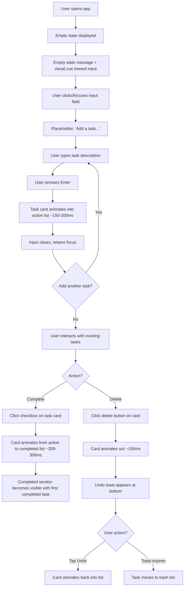
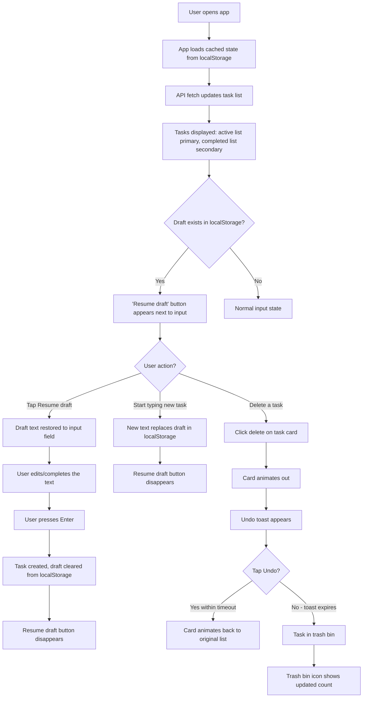
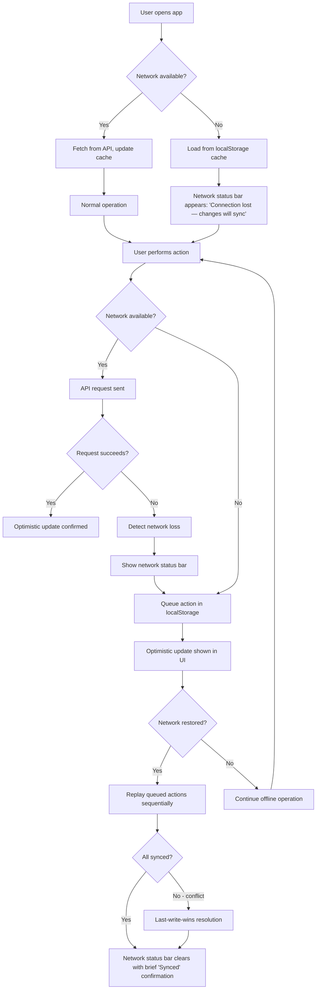

# UX Design Specification - bmad

**Author:** Valerio
**Date:** 2026-04-03

---

## Executive Summary

### Project Vision

A full-stack todo application where execution quality is the differentiator. The UX must feel finished, intentional, and immediate — proving that a deliberately minimal product can meet the polish bar of a premium tool. No onboarding, no sign-up, no feature bloat. Users open the app and manage tasks instantly.

### Target Users

**Alex, 32 — Busy Professional:** Project manager frustrated with overbuilt tools (Todoist, Notion, Apple Reminders). Tech-comfortable, uses desktop and mobile interchangeably. Wants a tool that stays out of the way. Values speed and zero friction.

**Mia, 20 — College Student:** Computer science student juggling assignments and personal errands. Frequently interrupted mid-task, multitasks across tabs. Needs reliability and state preservation. Values trust and data safety.

Both users expect modern, responsive interfaces and have zero tolerance for confusion or lag.

### Key Design Challenges

- **Two-list information hierarchy:** Active tasks must feel like the primary stage while completed tasks remain visible but visually subordinate. Getting the weight balance right without hiding useful context is critical.
- **Notification coexistence:** Undo toasts, network status alerts, and sync notifications must all function without stacking or overwhelming the minimal interface.
- **Draft resumption discoverability:** "Resume draft" must be noticeable when a draft exists and invisible otherwise, without adding clutter to the input area.

### Design Opportunities

- **Micro-interactions as differentiator:** Thoughtful animations on task creation, completion transitions between lists, and deletion can make the app feel alive — this is where polish becomes tangible.
- **Empty state as first impression:** The empty state is every user's first encounter. It communicates the product's entire personality in one screen.
- **Progressive disclosure of safety nets:** Trash bin and offline features stay hidden until relevant, keeping the default experience ultra-clean.

## Core User Experience

### Defining Experience

The product's core loop is **task entry**: type a description, press Enter, see it appear instantly. This single interaction defines the product. Every other action (complete, delete, restore) is secondary but must match the same standard of immediacy. The app should feel like a direct extension of the user's thought process — zero latency between intent and result.

### Platform Strategy

**Web SPA — responsive, single platform:**
- **Desktop:** Keyboard-first interaction model. Task entry via text input + Enter. Standard shortcuts for common actions (complete, delete). Mouse available but not required for core flows.
- **Mobile:** Touch-first with appropriately sized tap targets. Same visual hierarchy and information architecture, adapted for smaller viewports. Swipe gestures considered for future iterations but not MVP.
- **Offline:** App loads from cached state when offline. All actions queue locally and sync transparently on reconnect. The user should never perceive the difference between online and offline usage during normal interaction.

### Effortless Interactions

**Should feel invisible (zero thought required):**
- Adding a task — type and Enter, nothing else
- Completing a task — single click/tap, instant visual move to completed list
- Data persistence — no save buttons, no loading spinners during normal CRUD
- Draft recovery — "Resume draft" appears only when relevant, gone otherwise
- Offline transition — app continues working, notification is informational not blocking

**Should feel automatic (happens without user intervention):**
- Optimistic UI updates — state changes before server confirms
- Offline queue replay — pending actions sync silently on reconnect
- Trash bin cleanup — expired items purged without user management
- Local cache refresh — cached state stays current without manual refresh

### Critical Success Moments

- **First task added:** The moment Alex types a task and sees it appear instantly with no sign-up, no tutorial, no friction. This is the "this is better" moment.
- **Draft resumed:** Mia returns and sees her half-finished thought preserved. This is the "this app respects me" moment.
- **Undo saves the day:** Accidental delete reversed with one tap on the toast. This is the "I trust this app" moment.
- **Offline just works:** Alex on a train adds a task, sees no error, carries on. This is the "I don't even think about it" moment.

**Make-or-break flow:** First-time task creation. If a new user can't figure out how to add a task within 3 seconds of landing, the product fails its core promise.

### Experience Principles

1. **Instant over correct** — Show the result immediately via optimistic updates. Reconcile with the server silently. The user's perception of speed matters more than round-trip confirmation.
2. **Visible until learned, then invisible** — Draft indicators, trash bin access, and network status appear only when relevant. The default state is clean and minimal.
3. **Keyboard-native on desktop, touch-native on mobile** — Don't compromise one input model to serve the other. Each platform gets its natural interaction pattern.
4. **Safety without friction** — Undo toasts and trash bins protect users from mistakes without adding confirmation dialogs, warning modals, or extra steps to normal workflows.

## Desired Emotional Response

### Primary Emotional Goals

**Calm and focused.** The app should feel like a quiet, reliable workspace — not a productivity machine demanding attention. Users should feel settled when using it, not stimulated. The interface recedes behind the task at hand.

**Trustworthy.** Users should feel that the app has their back. Data is safe, mistakes are recoverable, and problems are handled transparently. Trust is earned through consistent, predictable behavior.

### Emotional Journey Mapping

| Stage | Desired Feeling | What Triggers It |
|---|---|---|
| First discovery | "This is refreshingly simple" | No sign-up, no tutorial, obvious input field |
| First task added | "That was instant" | Optimistic update, zero delay |
| Daily use | "Calm, focused, in control" | Clean two-list layout, no distractions |
| Returning after break | "Right where I left it" | Preserved state, draft resumption |
| Accidental delete | "They've got my back" | Undo toast appears immediately |
| Network failure | "It's handled" | Clear notification, app keeps working |
| After completing tasks | "Satisfying progress" | Tasks move visually to completed list |

### Micro-Emotions

**Prioritize:**
- **Confidence over confusion** — Every element's purpose is self-evident
- **Trust over skepticism** — The app proves its reliability through transparent behavior
- **Calm over excitement** — Understated, not flashy. Satisfaction, not dopamine
- **Accomplishment over frustration** — Completing a task should feel like a small, clean win

**Avoid:**
- Anxiety from unclear state (is my data saved? did that work?)
- Distrust from hidden behavior (where did my task go?)
- Overwhelm from visual noise (too many elements competing for attention)

### Design Implications

- **Calm and focused** → Generous whitespace, muted color palette, minimal UI chrome. No badges, counters, or gamification. Typography-driven hierarchy.
- **Trustworthy and transparent** → Network and sync status communicated honestly. Undo toast confirms the app caught the mistake. Trash bin is accessible but not prominent.
- **Satisfying progress** → Completion transition animation should feel deliberate and rewarding — a task visually moving from active to completed list. Not flashy, but noticeable.
- **Pleasant to look at** → Visual design should be attractive enough that users enjoy having it open. Clean enough to recommend to anyone regardless of technical skill.

### Emotional Design Principles

1. **Calm over clever** — No surprise animations, no gamification, no unnecessary motion. Every visual element serves clarity.
2. **Honest over hidden** — When something goes wrong, tell the user clearly and show it's being handled. Silent failure erodes trust.
3. **Satisfying over exciting** — Task completion should feel like a clean checkmark, not a confetti explosion. Understated polish, not performance.
4. **Welcoming over exclusive** — The app should feel approachable to anyone. No jargon, no complexity signals, no learning curve.

## UX Pattern Analysis & Inspiration

### Inspiring Products Analysis

**Gmail — Interaction model reference:**
- Keyboard-first on desktop with full shortcut system; touch-native on mobile
- Undo toast bar for destructive actions — non-blocking, timed, bottom-positioned
- Two-level hierarchy: list view (scannable) and detail view (focused)
- Optimistic updates on archive/delete — action happens instantly, server catches up

**GitHub — Information hierarchy reference:**
- Typography-driven hierarchy with generous whitespace
- Status indicators are subtle (colored dots, icons) but immediately scannable
- Dense information presented without feeling cluttered — every element earns its space
- Trusts user competence — no tooltips on obvious actions, no onboarding overlays

**PayPal — Trust communication reference:**
- Status transparency builds confidence — users always know where things stand
- Error states are honest and actionable, not vague
- Visual design communicates reliability through consistency and restraint
- Confirmations are clear without being interruptive

### Transferable UX Patterns

**From Gmail:**
- Bottom-positioned undo toast with timed auto-dismiss — directly applicable to deletion flow
- Keyboard shortcut model for desktop power users — Enter to create, shortcuts for complete/delete
- Optimistic UI pattern — action reflects in UI before server confirmation

**From GitHub:**
- Typography and spacing as primary hierarchy tools — no need for heavy borders or background colors
- Subtle status indicators (completion state) that are scannable at a glance
- Information density that respects whitespace — clean without being empty

**From PayPal:**
- Transparent status communication for network/sync states — "we're handling it" messaging
- Consistent visual language builds trust over time
- Error states that inform and guide rather than alarm

### Anti-Patterns to Avoid

**From Trello:** Feature creep that buries the core interaction. Every new capability adds visual weight. The lesson: resist the urge to surface options that most users won't need. Keep the default view ruthlessly minimal.

**From Jira:** Complexity as default. Requiring users to understand workflows, issue types, and field configurations before doing basic work. The lesson: never make the user learn your system to use your product.

**From New Reddit:** Sacrificing speed and content clarity for engagement metrics and visual bloat. The lesson: performance and clarity are features. Don't trade them for aesthetics or monetization.

### Design Inspiration Strategy

**Adopt:**
- Gmail's undo toast pattern — bottom-positioned, timed, with single undo action
- GitHub's typography-driven hierarchy — use font weight, size, and spacing instead of borders/backgrounds
- PayPal's transparent status communication for network and sync state

**Adapt:**
- Gmail's keyboard model — simplified for a much smaller action set (create, complete, delete, navigate)
- GitHub's information density — lighter version appropriate for a single-purpose app with less data

**Avoid:**
- Trello's feature surface area — every future feature must prove it won't clutter the default view
- Jira's workflow complexity — no configuration, no settings, no modes
- Reddit's engagement-driven design — no promoted content, no gamification, no engagement hooks

## Design System Foundation

### Design System Choice

**Tailwind CSS + Headless UI Primitives** (Radix UI or Headless UI)

Utility-first CSS framework for full visual control paired with unstyled, accessible component primitives for interactive elements. All styling is custom; all interaction patterns are proven.

### Rationale for Selection

- **Full visual control** — Nothing looks "off the shelf." The calm, typography-driven, GitHub-inspired aesthetic requires pixel-level control that themed libraries constrain.
- **Accessibility for free** — Headless primitives handle keyboard navigation, focus management, ARIA attributes, and screen reader support without custom implementation. Critical for meeting the basic a11y requirement as a solo dev.
- **Solo-dev efficient** — Tailwind's utility classes eliminate context-switching between CSS files. Headless primitives eliminate the need to build toast notifications, focus traps, and keyboard interactions from scratch.
- **No visual baggage** — Unlike themed libraries, there's no default look to override. The design starts from zero and builds up, matching the "every element earns its space" philosophy.

### Implementation Approach

**Tailwind CSS:**
- Utility-first styling for all layout, spacing, typography, and color
- Custom theme configuration for the muted, calm color palette
- Responsive breakpoints for desktop/tablet/mobile
- Dark mode support via Tailwind's built-in dark variant (future consideration)

**Headless Primitives (Radix UI recommended):**
- Toast component — for undo-deletion notifications and network status alerts
- Visually Hidden — for screen reader-only content
- Focus management utilities — for keyboard navigation flows
- Additional primitives as needed (e.g., dialog for trash bin view)

### Customization Strategy

**Design Tokens (via Tailwind config):**
- Color palette: muted, calm tones — no saturated primaries. Accent color for interactive elements only.
- Typography scale: limited set (3-4 sizes) with clear hierarchy. Font weight as primary differentiator between heading and body.
- Spacing scale: generous whitespace — default to more space, not less.
- Border radius: consistent, subtle rounding — nothing playful or aggressive.
- Transitions: short durations (150-200ms), ease-out curves. Subtle, not showy.

**Component Patterns:**
- Build a small set of reusable components (TaskItem, TaskInput, Toast, StatusBadge) using Tailwind classes
- Compose complex views from these primitives
- Keep component count minimal — this app has very few distinct UI elements

## Core Interaction Design

### Defining Experience

**"Type, Enter, done."** The product's signature interaction is task creation: a text input, the Enter key, and an instant result. This pattern is universally understood — users bring the mental model from Gmail compose, terminal commands, and every search bar they've ever used. No innovation needed, just flawless execution.

### User Mental Model

Users expect a text input at the top of a list to behave as a direct command line: type something, press Enter, see it added. The mental model is **input → immediate output**. Any delay, confirmation dialog, or intermediate step violates this expectation.

**What users bring from existing tools:**
- Gmail: Enter sends, Ctrl+Enter for special actions
- GitHub: Input fields commit on Enter, status changes are instant
- Todo apps generally: Checkbox = done, X = delete, input = new

The app should honor these existing patterns exactly. No retraining required.

### Success Criteria

- Task appears in the active list within 100ms of pressing Enter
- Input field clears and regains focus immediately — ready for the next task
- New task animates in with a brief, fast entrance (no longer than 200ms)
- Completing a task triggers a satisfying transition animation as it moves to the completed list
- Deleting a task removes it with a brief exit animation while the undo toast appears
- The user never waits, never wonders "did that work?", never loses their place

### Novel UX Patterns

**No novel patterns required.** This app uses entirely established interaction patterns:
- Text input + Enter for creation (universal)
- Checkbox/click for completion (standard todo pattern)
- Delete action with undo toast (Gmail pattern)
- Two-list separation for active/completed (established)

The innovation is in execution quality, not interaction novelty. Every pattern should feel familiar on first use.

### Experience Mechanics

**Task Creation:**
1. **Initiation:** Text input is always visible at the top, auto-focused on page load. Placeholder text hints at the action ("Add a task...").
2. **Interaction:** User types task description, presses Enter.
3. **Feedback:** Task animates into the active list (fast slide-in or fade-in, ~150-200ms). Input clears and retains focus. Optimistic — no server wait.
4. **Completion:** User sees the task in the list instantly. Ready to add another or move on.

**Task Completion:**
1. **Initiation:** User clicks/taps the task or its checkbox in the active list.
2. **Interaction:** Single click/tap — no confirmation.
3. **Feedback:** Task animates out of the active list and into the completed list with a satisfying transition (~200-300ms). Visual state changes (muted text, strikethrough or similar).
4. **Completion:** Task is visibly in the completed list. Active list re-flows smoothly.

**Task Deletion:**
1. **Initiation:** User clicks/taps the delete action on a task.
2. **Interaction:** Single click/tap — no confirmation dialog.
3. **Feedback:** Task animates out (~150ms). Undo toast appears at the bottom with a timed countdown (few seconds). Task moves to trash bin if not undone.
4. **Recovery:** Undo tap restores the task with a reverse animation back into its original list.

**Task Reactivation:**
1. **Initiation:** User clicks/taps a completed task to mark it active again.
2. **Interaction:** Single click/tap.
3. **Feedback:** Task animates from completed list back to active list (~200-300ms). Visual state reverts.
4. **Completion:** Task is back in the active list, ready for work.

## Visual Design Foundation

### Color System

**Palette Philosophy:** Muted, calm tones that recede behind content. No saturated primaries competing for attention. Color is used sparingly and intentionally — for status, interaction, and emphasis only.

**Core Palette:**

| Role | Token | Usage |
|---|---|---|
| Background | `--bg-primary` | Main app background — near-white with a hint of warmth (e.g., `#FAFAF9`) |
| Surface | `--bg-surface` | Task cards, input field — subtle lift from background (e.g., `#FFFFFF`) |
| Text Primary | `--text-primary` | Task descriptions, headings — near-black (e.g., `#1C1C1C`) |
| Text Secondary | `--text-secondary` | Timestamps, metadata, completed tasks — muted gray (e.g., `#6B7280`) |
| Text Muted | `--text-muted` | Placeholder text, disabled states (e.g., `#9CA3AF`) |
| Accent | `--accent` | Interactive elements, focus rings, "Resume draft" indicator — single calm accent (e.g., muted blue `#4B7BF5` or teal `#0D9488`) |
| Success | `--success` | Completion checkmark, sync confirmed (e.g., `#22C55E`) |
| Warning | `--warning` | Network offline notification (e.g., `#F59E0B`) |
| Danger | `--danger` | Delete action hover, error states (e.g., `#EF4444`) |
| Border | `--border` | Subtle dividers between tasks (e.g., `#E5E7EB`) |

**Usage Rules:**
- Background and surface colors carry the layout. No heavy color blocks.
- Accent color appears only on interactive elements — links, focus states, active buttons.
- Status colors (success, warning, danger) appear only in context — never decorative.
- Completed tasks use `text-secondary` to visually demote without hiding.

### Typography System

**Font Choice:** Inter — geometric sans-serif, excellent readability at all sizes, variable font for precise weight control, free and widely available.

**Type Scale (compact):**

| Level | Size | Weight | Usage |
|---|---|---|---|
| App Title | 20px / 1.25rem | 600 (Semi-bold) | App name/header |
| Section Label | 13px / 0.8125rem | 600 (Semi-bold) | "Active" and "Completed" list headers |
| Task Text | 15px / 0.9375rem | 400 (Regular) | Task descriptions in active list |
| Task Completed | 15px / 0.9375rem | 400 (Regular) | Task descriptions in completed list — `text-secondary` color |
| Metadata | 12px / 0.75rem | 400 (Regular) | Timestamps, toast messages |
| Input | 15px / 0.9375rem | 400 (Regular) | Task input field — matches task text size |

**Typography Rules:**
- Font weight is the primary hierarchy differentiator — semi-bold for labels, regular for content
- No bold body text. No italics except for empty-state helper text.
- Line height: 1.5 for body text, 1.25 for headings
- Letter spacing: default (Inter is optimized out of the box)

### Spacing & Layout Foundation

**Base Unit:** 4px. All spacing derives from multiples of 4.

**Spacing Scale:**

| Token | Value | Usage |
|---|---|---|
| `--space-1` | 4px | Inline element gaps, icon padding |
| `--space-2` | 8px | Tight padding within task items |
| `--space-3` | 12px | Padding inside task cards, input field |
| `--space-4` | 16px | Gap between task items |
| `--space-6` | 24px | Section separation (between active and completed lists) |
| `--space-8` | 32px | Page margins on desktop |
| `--space-4-mobile` | 16px | Page margins on mobile |

**Layout Strategy:**
- **Single column, centered.** Max-width container (~640px) centered on screen. Content doesn't sprawl on wide monitors.
- **Compact task items.** Tasks stack tightly — 8-12px vertical padding per item, 16px gap between items. Prioritizes density so users see more tasks without scrolling.
- **Section stacking.** Input field at top → Active list → Completed list → Trash bin access at bottom. Vertical flow, no columns or panels.
- **Mobile adaptation.** Same single-column layout, reduced margins (16px). Touch targets expanded to minimum 44px height. No structural changes — the layout is inherently mobile-friendly.

### Accessibility Considerations

- All text/background combinations meet WCAG 2.1 AA contrast ratios (minimum 4.5:1 for body text, 3:1 for large text)
- Focus rings use accent color with sufficient contrast against background
- Interactive elements have minimum 44x44px touch targets on mobile
- Color is never the sole indicator of status — icons or text accompany all color-coded states
- Reduced motion media query respected — animations degrade to instant state changes for users who prefer reduced motion

## Design Direction Decision

### Design Directions Explored

Six directions were evaluated across layout style, visual weight, and interaction treatment:
- A (Clean Minimal), B (Card-Based), C (Border Accent), D (Dark Mode), E (Teal Accent), F (Ultra Minimal)

Full interactive mockups: `planning-artifacts/ux-design-directions.html`

### Chosen Direction

**Direction B: Card-Based**

Each task is a discrete card with soft shadow and subtle elevation. The input area is also a card. Rounded corners, gentle lift from the background. The completed section uses reduced opacity to visually demote without hiding.

### Design Rationale

- **Tactile quality** — Cards give each task visual weight and boundaries, making them feel like real objects. This supports the animation strategy: tasks visually "move" between lists as cards, not as rows in a table.
- **Calm visual rhythm** — Soft shadows and rounded corners create a gentle, non-aggressive aesthetic that aligns with the "calm and focused" emotional goal.
- **Clear affordance** — Card boundaries make interactive areas obvious without relying on hover states alone, improving mobile touch targeting.
- **Scalable pattern** — Cards work well as the base component for future features (prioritization badges, categories, deadlines) without requiring structural redesign.
- **Background differentiation** — The gray app background (`#F3F4F6`) with white cards creates natural depth, making the content layer distinct from the app chrome.

### Implementation Approach

**Card Component (Tailwind):**
- White background, `rounded-xl` (10-12px), `shadow-sm` default, `shadow-md` on hover
- Consistent internal padding (12px)
- 6px gap between cards in the list
- Transition on shadow for hover state (150ms ease-out)

**Input Card:**
- Same card treatment as tasks — white background, rounded, shadow
- Contains the text input and "Resume draft" button inline
- Focus state: subtle ring or border-color change on the card

**Completed Section:**
- Cards at reduced opacity (0.6) — same structure, visually demoted
- Completed text uses `text-secondary` color with strikethrough

**App Background:**
- Light gray (`#F3F4F6`) provides depth separation from white cards
- Clean, neutral — cards "float" on the surface

## User Journey Flows

### Journey 1: First-Time Use (Alex)

**Empty State Design:**
- Centered message: friendly, brief, non-instructional (e.g., "No tasks yet" with a subtle hint like "Type above to get started")
- Input field visible above the message but not auto-focused — lets the user take in the screen first
- Empty state disappears as soon as the first task is created
- No illustrations or heavy graphics — typography only, consistent with the calm aesthetic

**Key UX Decisions:**
- Input is always visible at top, even during empty state — it's the permanent entry point
- First completed task creates the completed section dynamically — it doesn't exist as an empty section
- Trash bin link appears at the bottom only after the first deletion event

### Journey 2: Returning User with Draft (Mia)

**Draft Resumption Design:**
- "Resume draft" button appears inside the input card, right-aligned next to the text input
- Styled as a subtle pill/chip — visible but not aggressive (accent color outline, small text)
- Tapping it populates the input field with the saved draft text and places cursor at the end
- Button disappears once the user starts typing new content or submits the draft
- Draft is saved to localStorage on every keystroke with debounce (~300ms)

### Journey 3: Network Failure Recovery (Alex)

**Network Status Bar Design:**
- Appears below the input card, above the task lists
- Warning color background (`#FEF3C7`) with amber dot and clear text
- Non-blocking — user can continue all actions normally
- Disappears with a brief "Synced" state (green, ~2 seconds) when connection restores
- Does not stack with undo toasts — network bar is fixed position, toasts float at bottom

### Journey Patterns

**Consistent across all journeys:**

| Pattern | Implementation |
|---|---|
| Entry animation | Cards slide/fade in (~150-200ms ease-out) |
| Exit animation | Cards slide/fade out (~150ms ease-out) |
| Cross-list transfer | Card animates out of source, animates into destination (~200-300ms) |
| Undo toast | Bottom-positioned, timed (5 seconds), single action button |
| Status notifications | Fixed bar below input, non-blocking, color-coded |
| Optimistic updates | UI updates immediately, server reconciliation is silent |
| Progressive disclosure | Completed section, trash bin, and draft resume appear only when relevant |

### Flow Optimization Principles

1. **Zero-step entry** — The input field is always visible. No "new task" button to find or click first.
2. **Single-action operations** — Complete, delete, undo, and restore are all single click/tap. No confirmation dialogs ever.
3. **Contextual UI** — Resume draft, completed section, trash bin, and network bar only appear when they have content. The default state is the cleanest possible view.
4. **Graceful degradation** — Offline mode is functionally identical to online mode from the user's perspective. The only difference is an informational status bar.

## Component Strategy

### Design System Components

**From Radix UI (headless primitives, styled with Tailwind):**

| Component | Radix Primitive | Usage |
|---|---|---|
| Undo Toast | `@radix-ui/react-toast` | Deletion undo notification, sync confirmation |
| Trash Dialog | `@radix-ui/react-dialog` | Trash bin modal overlay |
| Visually Hidden | `@radix-ui/react-visually-hidden` | Screen reader-only labels |

**From Tailwind (utility classes, no library):**
- All layout, spacing, typography, color, and responsive behavior
- Animation utilities for card transitions
- Focus ring styles for keyboard navigation

### Custom Components

**TaskCard**
- **Purpose:** Displays a single todo item as a card
- **Anatomy:** Checkbox (left) + task text (center, flex) + metadata (right) + delete button (right)
- **States:** Default, hover (elevated shadow), completing (animating out), entering (animating in)
- **Variants:** Active (full opacity, primary text) and Completed (reduced opacity, secondary text, strikethrough)
- **Accessibility:** Checkbox is focusable with Space/Enter to toggle. Delete button is focusable with Enter to trigger. Card itself is not a button — individual actions are.
- **Interaction:** Hover elevates shadow. Checkbox click triggers completion/reactivation. Delete click triggers removal + toast.

**InputCard**
- **Purpose:** Primary task entry point — always visible at top of page
- **Anatomy:** Card container + text input (left, flex) + optional DraftChip (right)
- **States:** Default, focused (accent ring on card), with-draft (DraftChip visible)
- **Accessibility:** Input is auto-labeled via placeholder + visually hidden label. Enter submits. Escape clears input.
- **Interaction:** Type + Enter creates task. Focus shows accent ring on the card container.

**DraftChip**
- **Purpose:** Indicates a saved draft exists and allows resumption
- **Anatomy:** Small pill/chip with accent color outline, "Resume draft" text
- **States:** Visible (draft exists), hidden (no draft or user started typing new content)
- **Accessibility:** Focusable button with descriptive label ("Resume draft: [truncated text]")
- **Interaction:** Click/tap populates input with draft text. Disappears when user types new content or submits.

**EmptyState**
- **Purpose:** First-time user greeting when no tasks exist
- **Anatomy:** Centered text block — primary message + secondary hint
- **States:** Visible (no active tasks), hidden (tasks exist)
- **Content:** "No tasks yet" (primary, `text-primary`) + "Type above to get started" (secondary, `text-muted`)
- **Accessibility:** Decorative — not interactive, uses appropriate heading level

**NetworkBar**
- **Purpose:** Communicates network connectivity status
- **Anatomy:** Full-width bar below input card — status dot + message text
- **States:** Offline (warning amber), syncing (pulsing), synced (success green, auto-dismisses after 2s), hidden (normal operation)
- **Accessibility:** `role="status"` with `aria-live="polite"` for screen reader announcements

**TrashBin Button**
- **Purpose:** Access point to view and restore deleted items
- **Anatomy:** Trash icon + "Trash" label + item count badge
- **States:** Hidden (no trashed items), visible (items in trash), active (dialog open)
- **Accessibility:** Button with descriptive label ("Trash, 2 items")
- **Interaction:** Click opens Trash Dialog

**TrashDialog**
- **Purpose:** Modal overlay showing deleted items with restore option
- **Anatomy:** Dialog overlay + header ("Trash") + list of deleted TaskCards + close button
- **States:** Open, closed. Items show deletion date and days until auto-purge.
- **Accessibility:** Radix Dialog handles focus trap, Escape to close, ARIA attributes
- **Interaction:** Each trashed item has a "Restore" button. Close via X button, Escape, or clicking overlay.

**SectionHeader**
- **Purpose:** Labels for "Active" and "Completed" list sections
- **Anatomy:** Label text (semi-bold, `text-secondary`)
- **States:** Always visible when section has items
- **Accessibility:** Uses appropriate heading level (h2 or h3)

### Component Implementation Strategy

**Build order follows user journey criticality:**

1. **InputCard + TaskCard** — Core loop. Without these, nothing works.
2. **EmptyState** — First-time experience. Needed for first impression.
3. **Toast (Radix)** — Undo deletion. Needed before delete action ships.
4. **NetworkBar** — Offline resilience. Can ship slightly after core CRUD.
5. **DraftChip** — Draft resumption. Enhancement to input card.
6. **TrashBin Button + TrashDialog** — Deletion recovery. Needed after toast is in place.
7. **SectionHeader** — Simple, can be built alongside lists.

### Implementation Roadmap

**Phase 1 — Core (blocks everything):**
- TaskCard (active + completed variants)
- InputCard
- SectionHeader
- EmptyState

**Phase 2 — Safety nets:**
- Toast (Radix) for undo deletion
- TrashBin Button + TrashDialog (Radix Dialog)
- DraftChip

**Phase 3 — Resilience:**
- NetworkBar
- Sync confirmation toast variant

## UX Consistency Patterns

### Action Patterns

**Primary Action (task creation):**
- Enter key submits — no submit button needed on desktop
- On mobile, keyboard "return" key submits
- Input clears and retains focus immediately after submit
- Empty input + Enter does nothing (no empty task creation)

**Toggle Actions (complete/reactivate):**
- Single click/tap on checkbox — no confirmation
- Visual state change is immediate (optimistic)
- Card moves between lists with animation

**Destructive Actions (delete):**
- Single click/tap on delete button — no confirmation dialog
- Undo available via toast (5 seconds)
- Permanent deletion only via trash auto-purge (7 days)

**Recovery Actions (undo, restore):**
- Undo toast: single "Undo" button, reverses last delete
- Trash restore: "Restore" button per item in trash dialog
- Both return item to its original list (active or completed)

### Feedback Patterns

| Situation | Pattern | Duration | Position |
|---|---|---|---|
| Task created | Card animates into active list | 150-200ms | In-place |
| Task completed | Card animates from active to completed | 200-300ms | Cross-list |
| Task deleted | Card animates out + undo toast | 150ms out, toast 5s | Bottom toast |
| Undo successful | Card animates back into list | 200ms | In-place |
| Network offline | Amber status bar appears | Persistent until resolved | Below input |
| Network restored | Bar turns green "Synced" | 2 seconds then dismisses | Below input |
| Sync in progress | Subtle pulse on status bar | Until complete | Below input |
| No tasks exist | Empty state message | Persistent until first task | Center of list area |
| Initial data loading | Skeleton or subtle loading indicator | Until API responds | List area |
| API error on load | Error message with retry option | Persistent until resolved | List area |

**Feedback Hierarchy:**
1. **Inline feedback** (animations, state changes) — for successful actions, always
2. **Toast notifications** — for recoverable destructive actions only (delete)
3. **Status bars** — for persistent system states (network, sync)
4. **Full-area states** — for empty, loading, and error conditions

**No stacking rule:** Only one toast at a time. If a new delete happens while a toast is showing, the previous toast dismisses and the new one replaces it. Network bar and toasts occupy different positions and can coexist.

### Animation Patterns

**Motion Language:**

| Animation | Duration | Easing | Usage |
|---|---|---|---|
| Card enter | 150-200ms | ease-out | New task appears in list |
| Card exit | 150ms | ease-out | Task deleted from list |
| Card transfer | 200-300ms | ease-in-out | Task moves between active/completed |
| Toast enter | 200ms | ease-out | Undo notification slides up from bottom |
| Toast exit | 150ms | ease-in | Toast dismisses |
| Shadow hover | 150ms | ease-out | Card shadow elevates on hover |
| Status bar enter | 200ms | ease-out | Network bar slides in |
| Status bar exit | 200ms | ease-in | Network bar slides out |

**Animation Rules:**
- All animations respect `prefers-reduced-motion` — degrade to instant state changes
- No animation exceeds 300ms — everything feels snappy
- Easing is always ease-out for entrances (decelerates), ease-in for exits (accelerates)
- No bouncing, no overshoot, no spring physics — clean and calm

### Keyboard Patterns (MVP)

| Key | Context | Action |
|---|---|---|
| Enter | Input field focused | Create task from input text |
| Escape | Input field focused | Clear input text |
| Tab | Anywhere | Standard focus navigation through interactive elements |

**Phase 2 additions (post-MVP):**
- Arrow key navigation through task list
- Keyboard shortcut to complete/delete focused task
- Global shortcut to focus input field

### State Patterns

**Loading State:**
- Shown during initial API fetch on app load
- Subtle — skeleton cards or a minimal spinner within the list area
- Input card is already visible and functional (can type while loading)

**Error State:**
- Shown when initial API fetch fails
- Clear message: "Couldn't load your tasks" + "Retry" button
- If cached data exists, show cached data with a subtle warning instead of full error

**Empty State:**
- Shown when no active tasks exist
- "No tasks yet" + "Type above to get started"
- Typography only, no illustrations
- Disappears when first task is created

## Responsive Design & Accessibility

### Responsive Strategy

**Mobile-first approach.** The single-column, centered layout is inherently responsive — no structural changes are needed between breakpoints. Adaptations are limited to spacing, touch targets, and minor density adjustments.

**Desktop (lg: 1024px+):**
- Max-width container (640px) centered on screen with generous surrounding whitespace
- Page margins: 32px
- Hover states active on cards (shadow elevation)
- Delete buttons always visible
- Keyboard shortcuts functional

**Tablet (md: 768px):**
- Same 640px max-width container, centered
- Page margins: 24px
- Touch targets at minimum 44px height
- Hover states disabled (touch device)

**Mobile (< 768px):**
- Full-width layout with 16px page margins
- Touch targets expanded to 48px minimum height for comfortable thumb use
- Delete buttons always visible (no hover-to-reveal on touch)
- Card padding slightly increased for tap comfort
- Toast notification full-width at bottom of viewport

### Breakpoint Strategy

**Tailwind defaults:**

| Breakpoint | Width | Adaptation |
|---|---|---|
| Default (mobile) | < 640px | Full-width, 16px margins, expanded touch targets |
| `sm` | 640px+ | Container constrains to max-width |
| `md` | 768px+ | Increased margins (24px), stable layout |
| `lg` | 1024px+ | Full desktop experience, 32px margins, hover states |

**No layout shifts between breakpoints.** The single-column card-based layout is identical across all sizes. Only spacing, margins, and interaction model (touch vs. hover) change.

### Accessibility Strategy

**WCAG 2.1 AA compliance** for all critical paths. Basic level as defined in the PRD, with specific implementation:

**Color & Contrast:**
- All text meets 4.5:1 contrast ratio against its background
- Interactive elements meet 3:1 contrast ratio
- Color is never the sole status indicator — icons/text always accompany color
- Completed task strikethrough provides non-color differentiation alongside `text-secondary`

**Keyboard Navigation:**
- Full Tab-order through all interactive elements (input → task checkboxes → delete buttons → trash button)
- Enter/Space activates focused elements
- Escape closes dialogs and clears input
- Visible focus rings (accent color) on all focusable elements
- Radix primitives handle focus trapping in dialogs and toasts

**Screen Readers:**
- Semantic HTML: `<main>`, `<section>`, headings (`h1`-`h3`), `<ul>`/`<li>` for task lists
- Visually hidden labels for input field and icon-only buttons
- `aria-live="polite"` on NetworkBar and toast regions for dynamic announcements
- Task status changes announced (e.g., "Task completed", "Task deleted, undo available")
- Dialog announced on open with proper `aria-labelledby`

**Motion:**
- `prefers-reduced-motion` media query respected globally
- All animations degrade to instant state changes
- No auto-playing animations or motion loops

### Testing Strategy

**Responsive Testing:**
- Chrome DevTools device emulation for breakpoint verification
- Physical testing on at least one iOS and one Android device
- Browser testing: Chrome, Firefox, Safari, Edge (latest versions only)

**Accessibility Testing:**
- Automated: axe-core or Lighthouse accessibility audit in CI
- Manual: full keyboard-only navigation walkthrough of all journeys
- Screen reader: VoiceOver (macOS/iOS) for core flow validation
- Contrast: verify all color combinations with contrast checker tool

### Implementation Guidelines

**Responsive Development:**
- Mobile-first Tailwind classes — base styles are mobile, use `sm:`, `md:`, `lg:` prefixes to scale up
- Use `rem` for typography, Tailwind spacing utilities for layout
- Test touch targets with actual fingers, not just pixel measurements
- No horizontal scrolling at any viewport width

**Accessibility Development:**
- Start with semantic HTML before adding ARIA — only use ARIA to fill gaps
- Every interactive element must be reachable via Tab and activatable via keyboard
- Test with screen reader after building each component, not at the end
- Include `<meta name="viewport" content="width=device-width, initial-scale=1">` — no `user-scalable=no`
